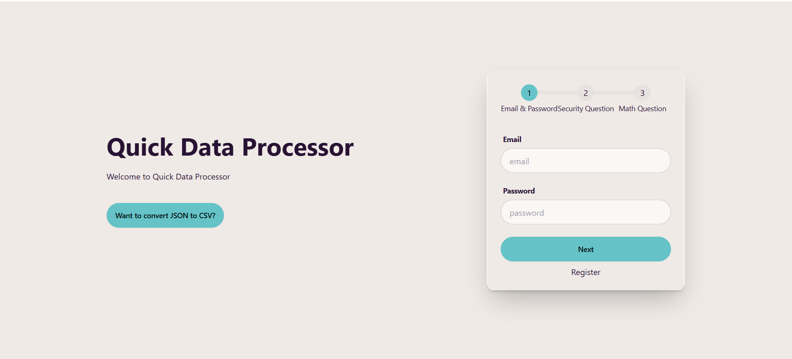
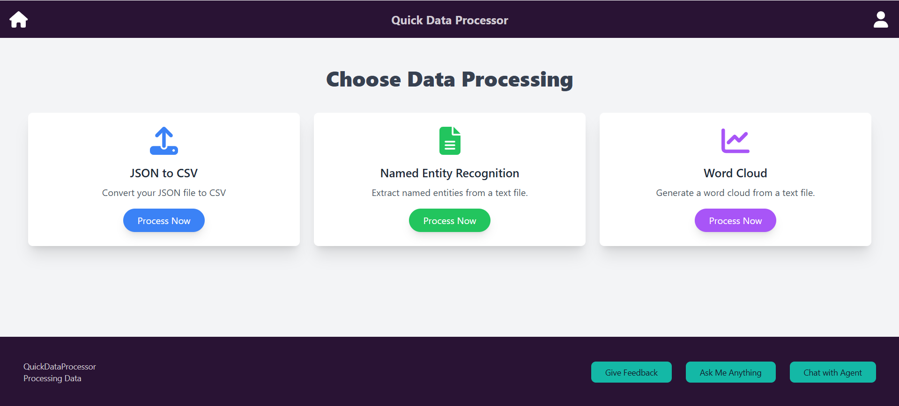
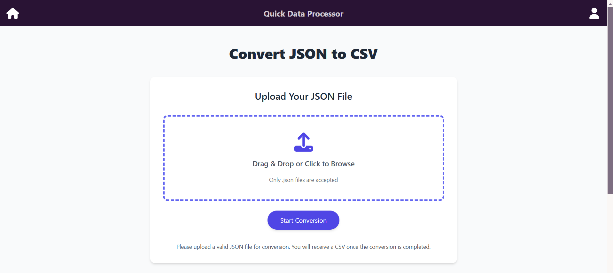
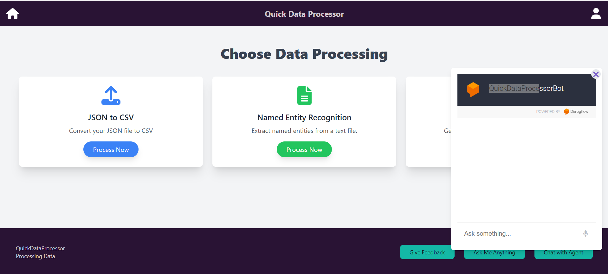

# QuickDataProcessor (QDP) - Serverless Data Processing Platform

QuickDataProcessor (QDP) is a serverless, multi-cloud application designed to simplify on-demand data processing. Built as part of the Serverless Data Processing subject, QDP leverages advanced cloud services and serverless architecture to deliver an efficient, secure, and scalable solution for data management, virtual assistance, notifications, and analytics.

**Deployed URL:** [QuickDataProcessor Live Application](https://frontend-service-791648625124.us-central1.run.app/)

---

## Table of Contents
1. [Features](#features)
2. [Technologies Used](#technologies-used)
3. [Installation & Setup](#installation--setup)
4. [Screenshots](#screenshots)
    - [Login & Register Example](#login--register-example)
    - [Dashboard Example](#dashboard-example)
    - [Data Processing](#data-processing)
    - [Virtual Assistant](#virtual-assistant)
5. [Challenges & Learnings](#challenges--learnings)
6. [Conclusion & Future Enhancements](#conclusion--future-enhancements)
7. [Contact](#contact)

---

## Features

- **User Management & Authentication**:
  - Implemented using AWS Cognito with multi-factor authentication (MFA).
  - User details stored in DynamoDB for secure and scalable data management.

- **Virtual Assistant**:
  - Developed with Google Dialogflow for natural language interaction.
  - Supported by GCP Firestore for data storage and GCP Cloud Functions for integration.

- **Message Passing**:
  - Built with Google Pub/Sub for asynchronous communication between users and agents.

- **Notifications**:
  - Integrated AWS SNS and SQS for real-time notifications on registration, login, and data processing status.

- **Data Processing**:
  - Utilized AWS Glue for ETL (Extract, Transform, Load) processes.
  - Automated file format conversion (e.g., JSON to CSV) and data processing.

- **Data Analysis & Visualization**:
  - Used Google Natural Language API for sentiment analysis.
  - Created dashboards in Looker Studio for insights and reporting.

- **Deployment**:
  - Hosted on GCP Cloud Run for scalability and cost efficiency.
  - Automated deployments using GCP Deployment Manager.

---

## Technologies Used

- **Cloud Providers**: AWS, GCP
- **Authentication**: AWS Cognito
- **Serverless Frameworks**: AWS Lambda, GCP Cloud Functions
- **Database**: DynamoDB, Firestore
- **Message Queue**: Google Pub/Sub, AWS SQS
- **Notifications**: AWS SNS
- **Data Processing**: AWS Glue
- **Data Analysis**: Google Natural Language API, Looker Studio
- **Deployment**: GCP Cloud Run, GCP Deployment Manager
- **Other Tools**: Terraform, CI/CD Pipelines

---

## Installation & Setup

1. Clone the repository:  

2. Install dependencies for the front-end (React):
   ```bash
   cd frontend
   npm install
   ```
3. Deploy the serverless backend:
   - Configure AWS and GCP credentials.

4. Start the front-end application:
   ```bash
   npm start
   ```
---
##Architecture Diagram


---

## Screenshots

### Login & Register Example:


### Dashboard Example:


### Data Processing:


### Virtual Assistant:


---


## Challenges & Learnings

- **Challenge**: Implementing multi-factor authentication securely.  
  **Solution**: Used AWS Cognito with Lambda for sequential validation of factors.

- **Challenge**: Integrating serverless modules across AWS and GCP.  
  **Solution**: Designed modular services with APIs for seamless interoperability.

- **Challenge**: Processing large-scale data efficiently.  
  **Solution**: Leveraged AWS Glue for ETL processes and optimized Glue jobs for speed and reliability.

---

## Conclusion & Future Enhancements

QuickDataProcessor demonstrates the power of serverless architecture and multi-cloud deployment for scalable and secure data processing. Future enhancements include:

- Expanding the virtual assistant capabilities.
- Adding support for more file formats and data processing pipelines.
- Enhancing the notification system with mobile push notifications.
